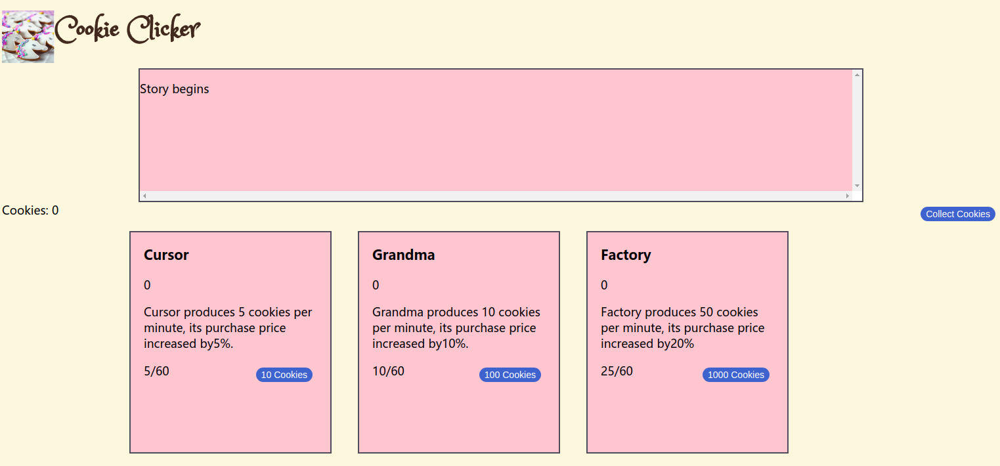
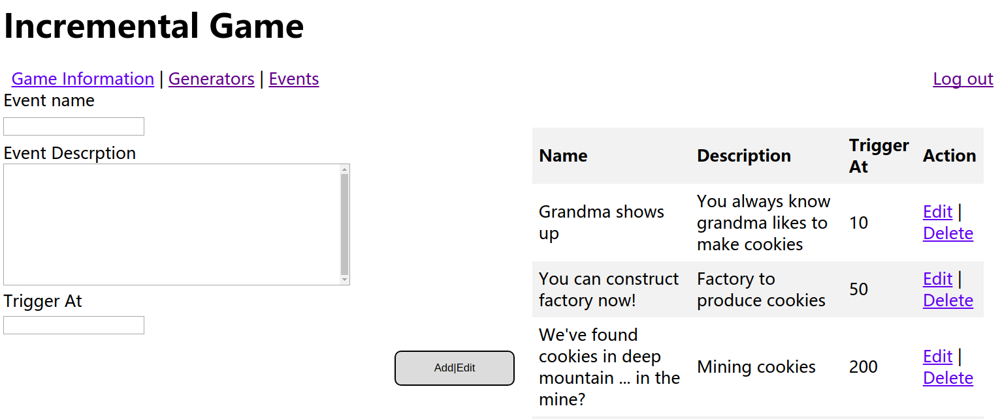
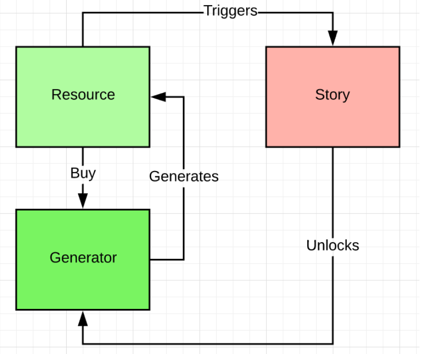
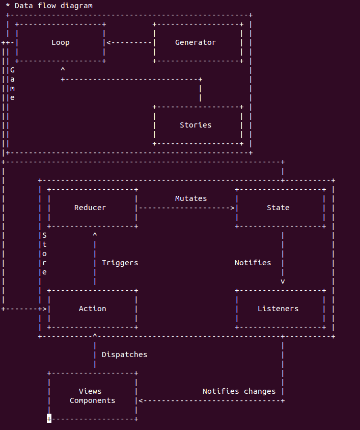




# About my project
My project name is about incremental game, called cookie clicker. My game is covered from user interface to backend side.</ br>
 

# What I do:
in client file:
most of them are js file. In order to run whole project, we need to bundle them(go to client run 'npm run build'.</ br>
First part for front end: client folder&index.html&game.css</br>
My professor designs whole data flow as below:


in src file:
clients send form data and create table for list of data in broswer. In the meanwhile, data will be also stored in the database via sql(code is here:/storage/mysql) or stored in backend(code is here:/storage/servlet).We still need servlet to pass data from web broswer to the web server, and then show entire performance of project.

updating the data in backend, it is also necessary to pass updated data back to the javascript, refresh the broswer. Json plays the important role. 
Second part for back end: src file&schema.sql


# How to run
in order to connect to database in backside, must to to src/storage/mysql/Database.java to modify the root and password.

go to client, npm install, npm test, npm run build(in order to bundle, under /dest, automatically create bundle.js), implement game website.

go to root directory, ./gradlew appRun

go to website:http://localhost:8080/game

## Java Web Application Starter with Gradle

This is the starter set to start Java application development with Gradle using
Gretty.

## Runtime dependencies

You will need Java, Node.js, Gradle to run this project (or simply Docker).

## Get Started

You can run `./script/start.sh` to start application and go to http://localhost:8080/hello
to see HelloServlet working.

You can start adding more Java Servlets under `src/main/java` folder to continue
hacking!

## Development

In brief, there are two side of story in this project: **front end development**
and **back end development**.

### File Structure

```
client/                         -> Front end resources
	src/                        -> Source codes
		app.js                  -> JavaScript entry/main file
	test/                       -> Test folder
	.babelrc                    -> JavaScript transpiling configuration (through BabelJS)
	package.json                -> Front end dependencies in npm packages (if any)
	webpack.config              -> Bundler configuration
src/main/
	/java/                  -> Your java classes
		edu/csula/web/HelloServlet.java -> HelloServlet for example
	/webapp/                -> Your front end resources
		js/                 -> JavaScript assets
			app.bundle.js   -> Bundled JavaScript code from `client/src`
build.gradle                    -> necessary gradle definition
build/                          -> built files
	classes                     -> compiled java classes
```
